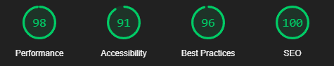
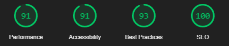

# 

Exciting tours for adventurous people. Discover breathtaking landscapes, thrilling adventures, and unforgettable experiences. Whether solo or with friends, our tours promise unique journeys and unforgettable experiences!

---

## About

Natours is a responsive website I developed to learn <b>Sass</b> as well as practice and enhance my skills in <b>HTML</b> and <b>CSS</b>. This project allowed me to explore advanced web design techniques, animations and effects, responsive designs, modern layouts, and best practices.

The course I followed-
_[Advanced CSS and Sass](https://www.udemy.com/advanced-css-and-sass/?couponCode=GITHUB4)_

---

## Features

- Fully responsive design for all devices.
- Advanced CSS animations and transitions.
- Modular Sass architecture for maintainable styles.
- Custom grid system for layout flexibility.

## Technologies Used

- **Sass (SCSS)**
- **HTML5**
- **CSS3**

---

## Lighthouse Reports

**Desktop Results**

**Mobile Results**

---

---

### Created by

### Contacts:

    
 

---
